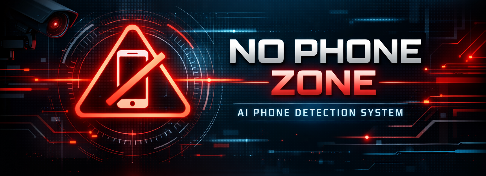
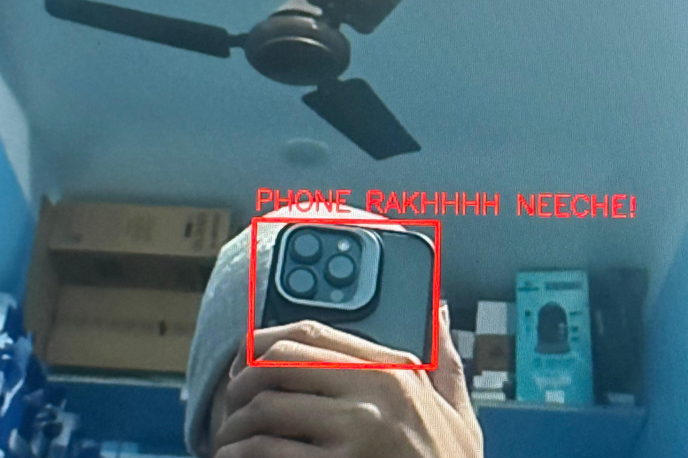

<p align="center">
  
</p>

<p align="center">
  <b>Real-time mobile phone detection with alarm using AI.</b>
</p>

<h1 align="center">No Phone Zone – AI Phone Detector</h1>

<p align="center">
  <b>YOLOv8 • OpenCV • Python • Real-Time Camera Monitoring</b><br>
  Version 1.0.0 • Developed by <a href="https://amitdas.site">Amit Das</a>
</p>

---

## 🧩 Overview

**No Phone Zone – AI Phone Detector** is a real-time computer vision system that detects mobile phones using your webcam and instantly triggers an alert sound.

It uses **YOLOv8 object detection** to identify mobile phones with high accuracy, even in low light or cluttered environments.

This project is ideal for:

* Exam hall monitoring
* Classroom attention systems
* Office security zones
* Computer vision learning

All processing happens **locally on your PC** — no internet required.

---

## ⚙️ Features

✅ Real-time phone detection via webcam
✅ AI-powered YOLOv8 object detection
✅ Smart cooldown system to avoid repeated alarms
✅ Red bounding boxes on detected phones
✅ Loud audio alert on detection
✅ Works fully offline after setup

---

## 🖥️ How It Works

1. Webcam captures live frames
2. Frames are sent to **YOLOv8 Nano model**
3. AI detects the object class **“cell phone”**
4. Bounding box is drawn around the phone
5. Alarm plays when detection is confirmed
6. Cooldown prevents alert spamming

---

## 🛠️ Requirements

* Python 3.9+
* OpenCV
* Ultralytics YOLO
* Pygame

### Install dependencies

```bash
pip install opencv-python ultralytics pygame
```

---

## ▶️ Run the Project

```bash
python no_phone_zone.py
```

Press **Q** to stop and close the camera window.

---

## 🖼️ Screenshots

### 📱 Phone Detected

<p align="center"></p>

### 🎥 Live Camera View

<p align="center">
  <a href="https://www.youtube.com/" target="_blank">
    
  </a>
</p>

---

## 🔒 Safety Disclaimer

This project is for **educational and demonstration purposes only**.
It should not be used as a replacement for professional surveillance systems.

---

## 📜 License

MIT License
© 2026 **Amit Das**

---

<p align="center">
  <b>Made with ❤️ by <a href="https://amitdas.site">Amit Das</a></b><br>
  ☕ Support development: <a href="https://paypal.me/AmitDas4321">PayPal.me/AmitDas4321</a>
</p>
